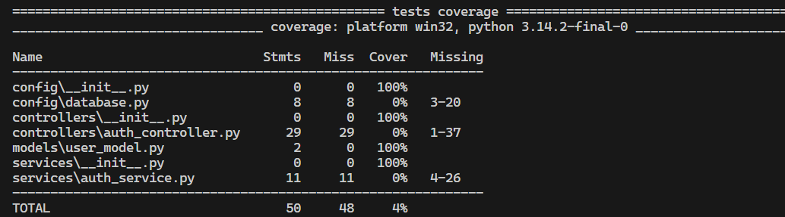

# python-testes

Execução de testes unitario e de cobertura com arquivo pytest.ini:

pytest --cov=models.user_model
pytest --cov=models.user_model --cov-report=term-missing
pytest --cov .\test\ --cov-report=term-missing
pytest --cov=models.user_model --cov-report=term-missing --cov-report=html
pytest --cov=models.user_model --cov-report=term-missing --cov-report=html --cov-fail-under=60

